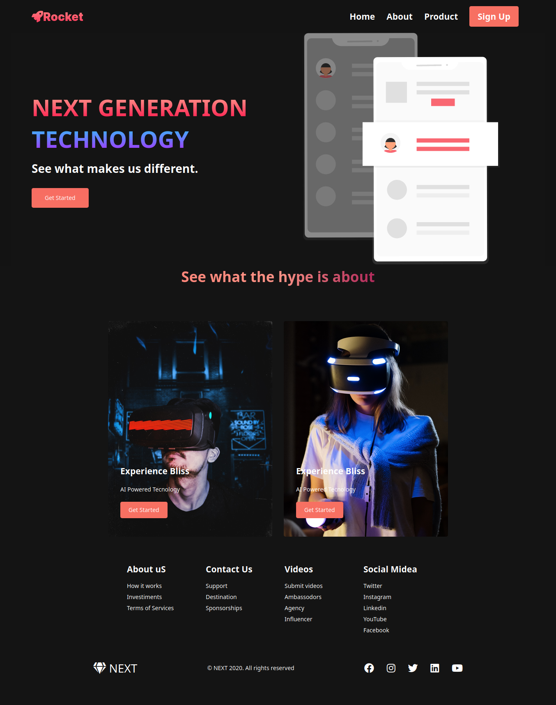

<!-- PROJECT LOGO -->
 

  <h3 align="center">Rocket</h3>

  

  Apenas um projeto para praticar CSS
  

## O projeto

<h1 align="center">
    
</h1>

<h1 align="center">
    
</h1>

### Desenvolvido com

- [HTML]()
- [CSS]()

### Pre-requisitos

Só precisas ter um editor de código

## Contato

Fernando dos Santos - [@codder404](https://twitter.com/codder404)
